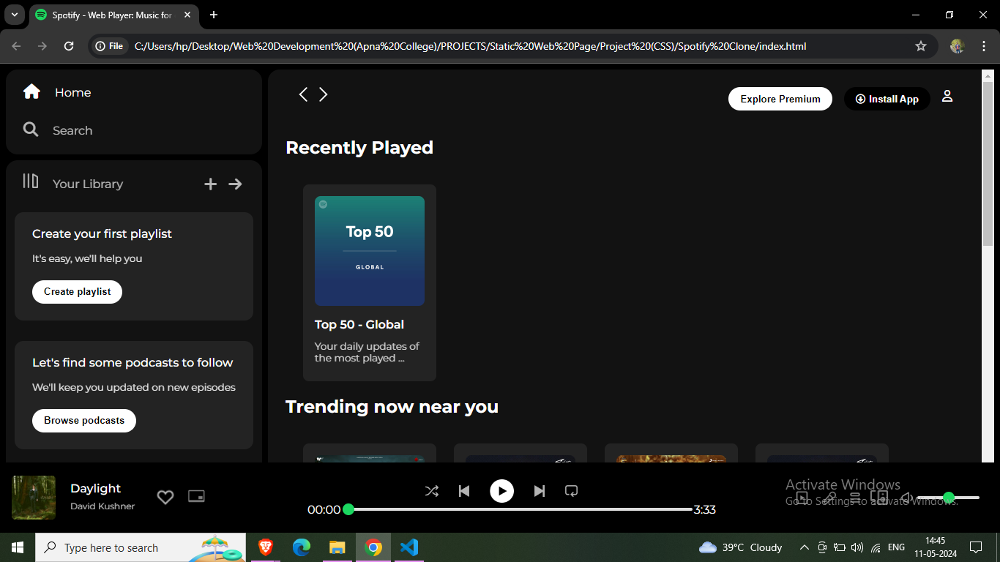

# Spotify Clone

This project is a static web page that serves as a clone of the Spotify web player interface. It is built using only HTML and vanilla CSS and is intended as a demonstration of front-end web development skills.

## Features

- **Static Web Page:** The Spotify clone is a static web page, meaning it does not have any backend functionality or dynamic content. It is designed purely for display purposes.
- **HTML and CSS Only:** The project is developed using only HTML and vanilla CSS, showcasing proficiency in front-end technologies.
- **UI Clone:** The design closely resembles the Spotify web player interface, including the layout, color scheme, and visual elements.

## Usage

To view the Spotify clone web page:

1. Clone or download the repository to your local machine.
2. Open the `index.html` file in a web browser to view the Spotify clone.

## Screenshots

